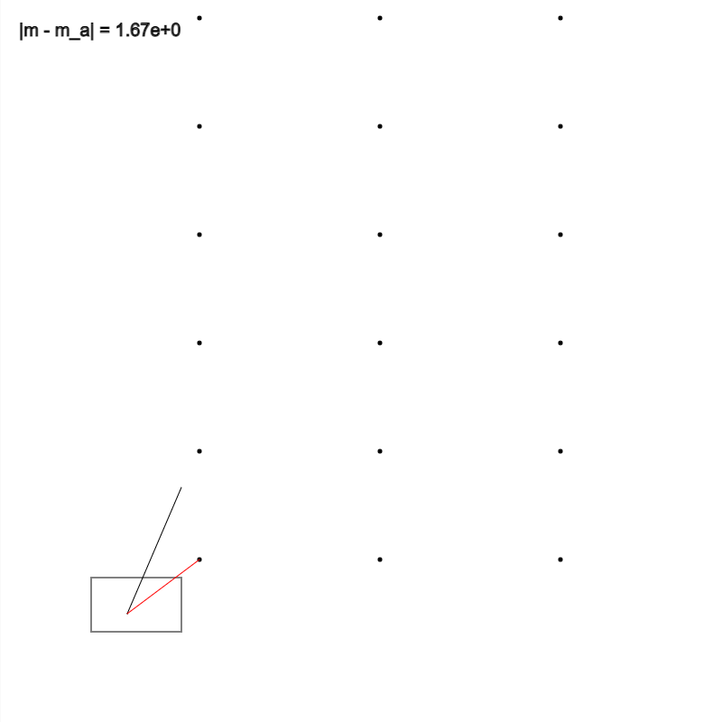

# Sight in a Mirror Room

I came across a programming problem which has an interesting mathematical solution.

The problem statement is as follows (with reduced fluff): There's a rectangular room with mirrored wall and two points *source* $s$ and *target* $t$. The dimensions of the room $(w, h)$ and the locations of the points have integer coordinates. The points are contained within the room, never on a wall. The question asks how many directions there are that $s$ can look in, and see $t$. The line-of-sight ray reflects when hitting the wall and can in principle bounce forever. To restrict the number of solutions the ray "stops" after a given distance $D$.

The common way of thinking about these problems is not to reflect the ray, but copy and mirror the room instead. This is easier to work with since the ray remains an (infinite) straight line, i.e. a mathematical *line*. This results in an infinite grid or lattice of adjacent copies of the room.

$$\begin{tikzpicture}
  % Draw the rectangular box
  \draw (0,0) rectangle (4,3);
  
  % Draw the point
  \fill (1,2) circle (2pt) node[above] {s};
  
  % Define the slope of incidence
  \pgfmathsetmacro{\slope}{30}
  
  % Draw the incident ray
  \draw (1,2) -- ++(\slope:2) coordinate (incident);
  
  % Calculate the slope of reflection
  \pgfmathsetmacro{\reflectslope}{0 - \slope}
  
  % Calculate the reflection point
  \path (incident) -- ++(\reflectslope:1) coordinate (reflection);
  
  % Draw the reflected ray
  \draw (incident) -- (reflection);
\end{tikzpicture}$$

$$\begin{tikzpicture}
  % Draw the rectangular box
  \draw (0,0) rectangle (4,3);
  \draw (0,3) rectangle (4,6);
  
  % Draw the point
  \fill (1,2) circle (2pt) node[above] {s};
  % Draw a reflection
  \fill (1, 4) circle (2pt) node[above] {s'};
  
  % Define the slope of incidence
  \pgfmathsetmacro{\slope}{30}
  
  % Draw the incident ray
  \draw (1,2) -- ++(\slope:3) coordinate (incident);
  
\end{tikzpicture}$$

## The programming solution

There are some observations which make the solution easier to find. Firstly, if a target point is obstructed by another point. Secondly, the obstructing point has the same slope.

The first point leads a solution where we test for each target whether there is an obstructing point by searching radially outwards (with increasing distance). This ensures we have seen the obstructor before the obstructee. Every target and source found in this fashion is recorded.
To make the *obstruction query* fast we don't store the point itself and do a linear search, but we store the slope of the point in a (hash) set. This turns it into a $\mathcal{O}(1)$ query. 
There's a minor detail here to be aware of though. Storing the slope $m = \frac{y}{x}$ directly has three issues namely: the calculated slope is in floating-point and equality in float is finicky. It's preferable to stay in integer math. Secondly, two points on opposite directions of the origin have the same slope, but they can only obstruct each other if they point in the same direction. The third is that a purely vertical line has infinite slope. All issues are sidestepped by storing the tuple $(x', y')$ instead, where $x'$ and $y'$ are the nominator and denominator of the reduced fraction $(x', y') = \left(\frac{x}{\left|\text{gcd}(x, y)\right|}, \frac{y}{\left|\text{gcd}(x, y)\right|}\right)$.

The second observation helps restrict the size of the slope set, because we can restrict the search to a cone if necessary. I used the four quadrants since it was easy to program that way.
## A slightly more interesting solution

When thinking about this problem, I though it should be possible to check whether a target point is being obstructed without having to record the points already seen. There's such a regular structure that I'd find it odd if one couldn't find the nearest copy either $s$ or $t$ in a given direction.

I kept the first part of the solution the same: iterating through the grid and testing whether a copy of the target is obstructed from the view of the original source.

There are at most four unique copies of $s$ and $t$, including the original, which are each repeated on a lattice with spacings of $(2w, 2h)$. Together they form the set $O$.

$$\begin{tikzpicture}

% Draw the rectangular box

\draw (0,0) rectangle (4,3);

\draw (0,3) rectangle (4,6);

\draw (4,3) rectangle (8,6);

\draw (4,0) rectangle (8,3);

% Draw the point

\fill (1,2) circle (2pt) node[above] {$s_0$};

\fill (2,1) circle (2pt) node[above] {$t_0$};

  

\fill (7,2) circle (2pt) node[above] {$s_1$};

\fill (6,1) circle (2pt) node[above] {$t_1$};

\fill (7, 4) circle (2pt) node[above] {$s_2$};

\fill (6, 5) circle (2pt) node[above] {$t_2$};

  

\fill (1,4) circle (2pt) node[above] {$s_3$};

\fill (2,5) circle (2pt) node[above] {$t_3$};

  

\end{tikzpicture}$$
$$\begin{tikzpicture}[scale=0.4]

% Draw the point

\fill (1,2) circle (2pt) node[below] {$s_0$};

\fill (2,1) circle (2pt) node[below] {$t_0$};

  

% Define the number of rows and columns in the grid

\def\nRows{1}

\def\nCols{1}

\def\boxMargin{0.05}

% Draw the grid of points

\foreach \row in {-\nRows,...,\nRows} {

\foreach \col in {-\nCols,...,\nCols} {

\draw (\row*2*4, \col*2*3) rectangle (\row*2*4 + 4, \col*2*3 + 3);

\draw[dashed] (\row*2*4 + 4 + \boxMargin, \col*2*3 + \boxMargin) rectangle (\row*2*4 + 4 + 4 - \boxMargin, \col*2*3 + 3 - \boxMargin) ;

\draw[dashed] (\row*2*4 + \boxMargin, \col*2*3 + 3 + \boxMargin) rectangle (\row*2*4 + 4 - \boxMargin, \col*2*3 + 3 + 3 - \boxMargin);

\draw[dashed] (\row*2*4 + 4 + \boxMargin, \col*2*3 + 3 +\boxMargin) rectangle (\row*2*4 + 4 + 4 - \boxMargin, \col*2*3 + 3 + 3 - \boxMargin);

\fill (\row*2*4 + 2, \col*2*3 + 1.5) circle (4pt);

}

}

  

  

\end{tikzpicture}$$
Now for each possible target point determining whether it's in view can be rephrased as trying to find a point on the lattice for each of the 8 possible obstructors, which is in the exact same direction as the target and nearer to the original source than the target. If no such point can be found, the target is in view and a new viewing direction has been found.

Now we'll focus on finding this obstructing lattice point for obstructor $p \in$ $O$ and a potential target $t$. The direction from source to target is $v = t - s$ and from source to obstructor $p$ is $u = p - s$.
Every lattice point formed from $p$ can be written as $p(k) = p + 2\left(wk_x, hk_y\right)$ for some $k=(k_x, k_y)$. The direction from $s$ to $p(k)$ is $u(k) = p(k) - s = 2\left(wk_x, hk_y\right) + (p - s) = 2\left(wk_x, hk_y\right) + u$. We'll keep it unnormalized to stay within the integers.
For two vectors to point in the same direction, their (normalized) dot-product has to be 1, or:
$$ 
\begin{align}
u(k) \cdot v &\triangleq \left|u(k)\right|\left|v\right| \\
\left(2 \, k_{x} w + p_{x} - s_{x}\right) v_{x} + \left(2 \, k_{y} w + p_{y} - s_{y}\right) v_{y} &= \sqrt{{\left| 2 \, k_{x} w + p_{x} - s_{x} \right|}^{2} + {\left| 2 \, k_{y} w + p_{y} - s_{y} \right|}^{2}} \sqrt{{\left| v_{x} \right|}^{2} + {\left| v_{y} \right|}^{2}}
\end{align}
$$
This is difficult to work with since we have a sum under the square root in $\left|u(k)\right|$. By squaring both sides this can be remediated. The squaring introduces a second solution: the one in the opposite direction, but doesn't make the equation easier to solve for $k$.

$$4 \, k_{x}^{2} v_{x}^{2} w^{2} + 8 \, k_{x} k_{y} v_{x} v_{y} w^{2} + 4 \, k_{y}^{2} v_{y}^{2} w^{2} + 4 \, k_{x} p_{x} v_{x}^{2} w - 4 \, k_{x} s_{x} v_{x}^{2} w + 4 \, k_{y} p_{x} v_{x} v_{y} w + 4 \, k_{x} p_{y} v_{x} v_{y} w - 4 \, k_{y} s_{x} v_{x} v_{y} w - 4 \, k_{x} s_{y} v_{x} v_{y} w + 4 \, k_{y} p_{y} v_{y}^{2} w - 4 \, k_{y} s_{y} v_{y}^{2} w + p_{x}^{2} v_{x}^{2} - 2 \, p_{x} s_{x} v_{x}^{2} + s_{x}^{2} v_{x}^{2} + 2 \, p_{x} p_{y} v_{x} v_{y} - 2 \, p_{y} s_{x} v_{x} v_{y} - 2 \, p_{x} s_{y} v_{x} v_{y} + 2 \, s_{x} s_{y} v_{x} v_{y} + p_{y}^{2} v_{y}^{2} - 2 \, p_{y} s_{y} v_{y}^{2} + s_{y}^{2} v_{y}^{2} = {\left| 2 \, k_{x} w + p_{x} - s_{x} \right|}^{2} {\left| v_{x} \right|}^{2} + {\left| 2 \, k_{y} w + p_{y} - s_{y} \right|}^{2} {\left| v_{x} \right|}^{2} + {\left| 2 \, k_{x} w + p_{x} - s_{x} \right|}^{2} {\left| v_{y} \right|}^{2} + {\left| 2 \, k_{y} w + p_{y} - s_{y} \right|}^{2} {\left| v_{y} \right|}^{2}$$

My second thought was to look at the exterior product instead. The exterior product should be $0$ when two vectors have the same slope. It can't tell whether the direction is the same, but there are other tools for that. So starting from the exterior product:
$$
\begin{align}
u(k) \wedge v &\triangleq 0  \tag{1}
\end{align}
$$
and working in cartesian coordinates:
$$
\begin{align}
((2wk_x, 2hk_y) - u) \wedge v &= 0 \\
(2wk_x, 2hk_y) \wedge v &= u \wedge v \\ 
2wv_yk_x - 2hv_xk_y &= u \wedge v \\
ak_x + b_ky &= c \tag{2}
\end{align}
$$This is a much more manageable form. The constants $a$, $b$ and $c$ are all independent from $k$. There's one remaining difficulty: we have two unknowns and one contraints, so infinite solutions!

Enter Bachet-Bézout. Bézout's identity states that 
$ax+by=g = \mathrm{gcd}(a, b)$ has solutions and they can be found with the extended Euclidian algorithm (egcd) for calculating the greatest common divisor. There are two "minimal" solutions of which the egcd calculates one.
Even more useful is that it says that any integer of the form $ar+bt$ **is** a multiple of $g$.

>This proves a (to me) surprising result: If $g \nmid c$, there are no lattice points with the same slope from $s$ as $v$! I find this surprising since the slope $m$ of $u = p - s$ is $m = \frac{u_y + 2wk_y}{u_x + 2hk_x}$ . For increasing distance from $p$, $k_x$ becomes larger which allows tweaks to $k_y$ to result in smaller and smaller changes to the slope.
$$    \left| m_0 - m_a \right| = \Delta m = m_0 + \frac{\Delta k_y}{u_x + 2*h*k_x}$$
This means we can approximate any given arbitrarily well, given we're working far enough away from $p$. Yet, some slopes just can't be achieved exactly.

The first check is thus whether $g \mid c$ and if not, the obstructor $p$ can't obstruct $v$. Let's continue.

The Bézout equation differs slightly from our original equation $(2)$. The good news is we now know that $c = qg$, and if we've found a solution (x, y) to the Bézout equation, we can transform it to one of our original by multiplying with $q$:
$$q(ax+by) = a(qx) + b(qy)=c=qg$$
$k = (qx, qy)$ is a solution.

We're still not there yet. It doesn't work the other way around: if $(k_x, k_y)$ is a solution to our equation, then $a\frac{k_x}{q} + b\frac{k_y}{q} = g$ is not guaranteed to work, since $\frac{k_x}{q}$ or $\frac{k_y}{q}$ are not guaranteed to be integers. So the solution we get from Bézout is not yet guaranteed to be the one closest to $p$.

Luckily once we find a $k_0$, the rest can be enumerated. 

$$ \begin{align}
a(k_{0x} + \Delta k_x) + b(k_{0y} + \Delta k_y) &= c \\
ak_{0x} + bk_{0y} + a\Delta k_x + b\Delta k_y &= c \\
a\Delta k_x + b\Delta k_y &= 0 \\
b\Delta k_y &= -a\Delta k_x \\
\Delta k_y &= \frac{-a\Delta k_x}{b}
\end{align}$$

Again $\Delta k_y$ and $\Delta k_x$ have to be integers. This is true when $\Delta k_x$ is a multiple of $\frac{b}{g} \triangleq \Delta_0 k_x$.  

Now it's important to check what we've got from the egcd.
If the initial $p(k_0)$ already points in the correct direction, we need to move as far as we can in the direction of $s$ without overshooting. If $p(k_0)$ is in the opposite direction of $v$, we need to move just enough to pass $s$.

$$\begin{tikzpicture}

% Draw the point

\fill (0, 0) circle (5pt) node[below,font=\LARGE] {$0$};

\fill (2,1) circle (4pt) node[left,font=\LARGE] {$s$};

\fill (5,8) circle (4pt) node[right,font=\LARGE] {$t$};

\def\nRows{2}

\def\nCols{2}

\def\nRows{1}

%\def\offx{2 + 3}

%\def\offy{1 + 7}

\def\offx{3.5}

\def\offy{4.5}

\fill (\offx - 6,\offy) circle (4pt) node[right,font=\LARGE] {$p_0$};

\draw[->, thick] (\offx +3, \offy + 7) -- (\offx, \offy) node[pos=1, sloped, below,font=\LARGE] {$ \lfloor p(k) \rfloor $};

\fill (\offx +3, \offy + 7) circle (2pt) node[left,font=\LARGE] {$p(k_0)$};

\draw[->, thick] (\offx +3, \offy + 7) -- (\offx - 3, \offy - 7) node[pos=1, sloped, below,font=\LARGE] {$\lceil p(k) \rceil $};

\draw[<->, dashed] (2, 1) -- (\offx +3, 1) node[midway,below,font=\LARGE] {$\Delta x$};

\draw[dashed] (\offx +3, 1) -- (\offx +3, \offy + 7);

  

\foreach \row in {-2,...,1} {

\foreach \col in {-1,...,1} {

\fill (\offx + \row*2*1.5, \offy + \col*2*3.5) circle (4pt);

}

}

  

\end{tikzpicture}$$

The horizontal distance from $s$ to $p(k_0)$ is $\Delta x = u_x + 2wk_{0x}$. One can calculate how many $k_{0x}$ just fit into $\Delta x$, or just exceed it.

$$
\Delta k_x =
\begin{cases}
\left\lceil \frac{\Delta x}{2w\Delta_0 k_x} \right\rceil & \text{if } p(k_0) \text{ is not in the same direction as } v \\
\\
\left\lfloor \frac{\Delta x}{2w\Delta_0 k_x} \right\rfloor & \text{if } p(k_0) \text{ is in the same direction as } v
\end{cases}
$$
All that's left is using the new $k = k_0 + \Delta k_x$ to calculate $\left|p(k) - s\right|$ and check whether it's smaller and thus blocking the view.

## Conclusion

While the Bézout method works, it is slower than the straightforward method. There are a whole lot of operations to arrive at the solution, many of which are divisions.
The only thing it has going for it is that is uses a fixed amount of memory instead of an ever growing set. However the $\mathcal{O}(n^2)$ traversal of every potential target is a much bigger concern and is going to be a bottleneck way before the set would occupy too much memory.
Let me know if there's a way to speed up this part!

All in all I am happy to learn of these results and working through all the details. This problem of finding a point on a misaligned lattice is a nice interpretation of the Bézout identity which I hadn't encountered before, but is quite obvious after the fact.